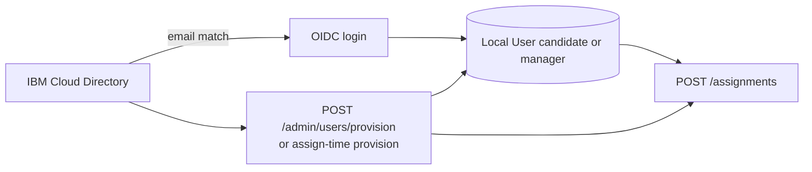
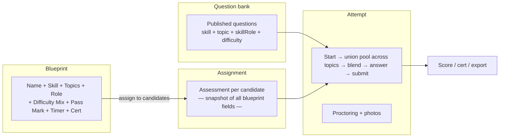

# Assessment OS — Product Plan & Reference

> Living reference for requirements, data model, and implementation status.  
> Last updated: June 2026 — Proctoring UX enhancement: consent flow, HUD, periodic photos, right-click block, admin review UI.

---

## 1. Vision

A multi-topic assessment platform where admins and capability managers maintain a question bank, define **named assessment blueprints**, assign them to candidates, and evaluate results with proctoring, certificates, analytics, and audit trails.

**Stack:** React 19 + Vite 6 + Tailwind 4 · Node 22 + Express 5 · PostgreSQL 17 + Prisma · Docker Compose.

---

## 2. Core data model

### 2.1 Entity relationships

```
Category (e.g. "eCommerce & Commerce Platforms")
  └── Topic  (e.g. "Adobe Commerce Development", "Adobe Commerce GraphQL")
              └── Question[]  — each question belongs to ONE topic

Skill (e.g. AC001 "Adobe Commerce")    — NOT nested under category
  └── SkillRole[]  — roles defined per skill: Developer, Senior Developer, Solution Architect
  └── Question[]   — each question is tagged to ONE skill + ONE topic

Question
  ├── topicId, skillId, skillRoles[]
  ├── questionType     (single | multi)
  ├── correctIndices[] (one index for single; two or more for multi)
  ├── difficulty, status
  └── options[] (2–5 choices)

AssessmentBlueprint / Assessment (snapshotted)
  ├── multiSelectScoringMode  (all_or_nothing | partial_credit)
  ├── proctoringPhotoIntervalMinutes  (0 = start only; n = periodic every n min)
  └── proctoringInstructions  (optional custom text appended to system defaults)

AssessmentBlueprint  — reusable named definition
  ├── name
  ├── skillId
  ├── skillRoleId
  ├── topics[]       (BlueprintTopic junction — ONE or MORE topics)
  ├── easyCount / mediumCount / hardCount
  ├── timeLimitMinutes
  ├── passMark               ← owned by blueprint, not by topic
  ├── issueCertificate       ←
  ├── showProficiencyOnCert  ←
  ├── certValidityDays       ←
  ├── revealAnswersAfterTest ←
  ├── proficiencyThresholds  ←
  ├── proctoringPhotoIntervalMinutes ←
  └── proctoringInstructions         ←

Assessment (assignment to one candidate)
  ├── userId / skillId / skillRoleId / assignedById
  ├── topics[]       (AssessmentTopic junction — inherited from blueprint)
  ├── easyCount / mediumCount / hardCount  (snapshot)
  ├── timeLimitMinutes  (snapshot)
  └── passMark / issueCertificate / ...  (snapshot from blueprint at assignment time — NEVER re-read from blueprint)
```

**How they work together**

| Entity | Purpose |
|--------|---------|
| **Category** | Groups topics for navigation and reporting. |
| **Topic** | Subject matter container for questions. Still holds default passMark/cert settings for standalone use; blueprints own their own copies. |
| **Skill** | Competency (code + name). **Roles are defined per skill**, not globally. |
| **SkillRole** | Job/grade band within a skill (e.g. for JS001 → "Associate Developer", "Senior Developer", "Tech Lead"). Filters the question pool with skill + topic(s). |
| **BlueprintTopic** | Junction that lets a blueprint draw questions from **multiple topics** (e.g. "AEM Dev Topics" + "AEM Author Topics"). |
| **AssessmentTopic** | Same multi-topic list snapshotted onto the assignment. |
| **Question** | MCQ tagged with topic + skill + **skill role(s)** + **difficulty**. One question can cover multiple roles within the same skill (Option B junction). |

One **skill** can appear across **many topics** (e.g. AC001 questions under "Adobe Commerce Development" and "Adobe Commerce GraphQL").  
One **blueprint** can draw from **many topics** — the eligibility pool is the union of all selected topics.

### 2.2 What an "assessment" means

| Concept | Description | Status |
|---------|-------------|--------|
| **Assessment blueprint** | Named definition: `name` + `skill` + `topic(s)` + `skillRole` + difficulty mix + pass mark + timer + cert settings. Reusable when assigning. | **Built** |
| **Assessment assignment** | Instance assigned to one candidate, copying all blueprint fields. Cert/pass settings are **snapshotted** — changing the blueprint later has no effect. | **Built** |
| **Assessment attempt** | Candidate session: question order, answers, score, proctoring, photos. | **Built** |

**Blueprint field set (current):**

| Field | Notes |
|-------|-------|
| `name` | e.g. "Adobe Commerce — Senior Developer Screen" |
| `skill` | skill id/code |
| `topics[]` | One or more topic IDs (questions are pooled across all) |
| `skillRole` | role defined under that skill |
| `easyCount / mediumCount / hardCount` | explicit difficulty mix |
| `timeLimitMinutes` | 0 = no limit |
| `passMark` | percentage, e.g. 65 |
| `issueCertificate` | toggle |
| `showProficiencyOnCert` | include proficiency band on certificate |
| `certValidityDays` | 0 = no expiry |
| `revealAnswersAfterTest` | show correct answers on result page |
| `proficiencyThresholds` | [novice, advanced_beginner, competent, proficient, expert] breakpoints |
| `multiSelectScoringMode` | How **multi-select** questions are scored (see §4) |
| `issueCapabilityReport` | Generate concept-level capability report when attempt completes |
| `shareCapabilityWithCandidate` | Candidate can view/download their capability report |
| `capabilityStrengthThreshold` / `capabilityGapThreshold` | Classify concept accuracy as strength / neutral / gap (defaults 70% / 40%) |

**Proficiency** is tracked per `(user, skill, skillRole)` in `CandidateSkillProficiency` — not a single global profile field. Updated automatically on pass (unless manually overridden).

**Concepts** are optional tags per skill on questions (`Concept` + `QuestionConcept`). Capability reports roll up attempt results by concept into strengths and gaps (`CapabilityReport` per attempt).

---

## 4. Question types and scoring

### 4.1 Question types

| Type | UI | Authoring | `correctIndices` |
|------|-----|-----------|------------------|
| **single** | Radio buttons — pick one | Default | Exactly one index |
| **multi** | Checkboxes — select all that apply | Set `questionType: multi` | Two or more indices |

Single-answer questions are always scored all-or-nothing regardless of blueprint setting.

### 4.2 Multi-select scoring mode (blueprint / assignment)

Configured on **AssessmentBlueprint** and snapshotted onto **Assessment** as `multiSelectScoringMode`:

| Mode | Behaviour |
|------|-----------|
| **all_or_nothing** | Candidate must select **exactly** the correct set — no more, no less. Full point or zero. |
| **partial_credit** | Each correct option selected adds `+1/|correct|`; each incorrect option selected subtracts `−1/|correct|`. Result clamped to `[0, 1]` per question. |

**Overall score:** `(sum of per-question points) / (number of questions) × 100`, rounded.

Example (partial credit, correct = B,C):
- Selected B,C → 1.0 point
- Selected B only → 0.5 point
- Selected B,C,D → 0.67 point (2 correct − 1 wrong, divided by 2)

### 4.3 Attempt answer storage

- In-progress answers: `currentAnswers` JSON — `{ questionId: number[] }` (always arrays)
- Submitted answers: `AttemptAnswer.selectedIndices`, `pointsEarned`, `isFullyCorrect`

---

### 3.1 Terminology

| Term | Meaning | Examples |
|------|---------|----------|
| **Access role** (RBAC) | Who can use the app | `admin`, `capability_manager`, `candidate` — on `User.roles[]`; session `activeRole` for switching |
| **Skill role** | Job/grade band within a skill | JS001 → "Associate Developer", "Senior Developer", "Tech Lead" |

**Why "role" fits better than "level":** Roles are per-competency and match actual job families; levels like "junior/senior" are generic and do not reflect domain differences (e.g. "Cloud Engineer" vs "Solutions Architect").

### 3.2 Roles defined per skill

```text
Skill JS001 "JavaScript"
  ├── ASSOC      "Associate Developer"  (sortOrder: 1)
  ├── SR_DEV     "Senior Developer"     (sortOrder: 2)
  └── TECH_LEAD  "Technical Lead"       (sortOrder: 3)

Skill AEM001 "Adobe Experience Manager"
  ├── DEV        "Developer"
  ├── SR_DEV     "Senior Developer"
  └── AUTHOR     "Content Author"
```

### 3.3 One question → many skill roles (Option B junction)

`QuestionSkillRole` junction: a single question stem can be tagged to **multiple roles within the same skill**.  
An AEM question can be tagged to both `AEM001/DEV` and `AEM001/SR_DEV` — no need to duplicate the stem.

### 3.4 Question pool and difficulty (two steps)

#### Step 1 — Eligibility pool

When a candidate starts an assessment, load all **published** questions matching:

```text
skillId     = assessment.skillId
topicId     IN assessment.topics    ← union across all assigned topics
skillRoleId = assessment.skillRoleId  (via QuestionSkillRole junction)
status      = published
```

Questions of **all difficulties** (easy/medium/hard) are included.

#### Step 2 — Paper composition

From the eligibility pool, pick questions using the **difficulty mix**:

```text
easyPool   = pool.filter(q => q.difficulty === easy)
mediumPool = pool.filter(q => q.difficulty === medium)
hardPool   = pool.filter(q => q.difficulty === hard)

Pick blueprint.easyCount   from easyPool   (random shuffle)
Pick blueprint.mediumCount from mediumPool
Pick blueprint.hardCount   from hardPool
// easyCount + mediumCount + hardCount === questionCount
```

Backfill from remaining pool if a difficulty bucket is short.

#### Pool validation (before assign)

Validate **per difficulty**:
```text
count(skillId, topicId IN topicIds, skillRoleId, difficulty=easy,   published) >= easyCount
count(skillId, topicId IN topicIds, skillRoleId, difficulty=medium, published) >= mediumCount
count(skillId, topicId IN topicIds, skillRoleId, difficulty=hard,   published) >= hardCount
```

---

## 4. Certificate and pass-mark ownership

| Setting | Owned by | Rationale |
|---------|----------|-----------|
| `passMark` | **Blueprint** (and snapshotted to Assessment) | Pass thresholds are assessment-type-specific, not topic-specific. A "Senior Developer" screen should have a higher pass mark than an "Associate" screen for the same topics. |
| `issueCertificate` | **Blueprint** | Some blueprints are screening-only (no cert); others are certification programs. |
| `showProficiencyOnCert` | **Blueprint** | Cert design choice per program. |
| `certValidityDays` | **Blueprint** | Program validity period. |
| `revealAnswersAfterTest` | **Blueprint** | Learning vs assessment-only policy. |
| `proficiencyThresholds` | **Blueprint** | May differ between Novice–Expert scales per program. |

**Topics** still store these fields as **author-configured defaults** for standalone ad-hoc use, but blueprints always use their own values.

**Snapshot rule:** All cert/pass settings are copied from the blueprint onto the `Assessment` row at assignment time. The attempt result and certificate logic read from `Assessment` directly — changing the blueprint later never retroactively affects existing assignments.

---

## 5. Implementation status

### 5.1 Delivered

- Monorepo: `client`, `server`, `packages/shared` (Zod enums/schemas)
- Auth: OIDC (IBM App ID) + dev login; RBAC: admin, capability_manager, candidate
- **IBM App ID integration:** Cloud Directory user list/search/create/bulk import; App ID role display; OIDC role mapping; management API (`APPID_*` env)
- **Staff profile UI:** Admin **Users → Profile** and Manager **Candidates → detail** — full staffing edit, remarks, per skill+role proficiency override, audit log (`ManageCandidateProfile`)
- CRUD: categories, skills, topics, questions (draft/publish), users, profile field definitions
- **Skill roles**: `SkillRole` model, CRUD under each skill, Option B junction (`QuestionSkillRole`)
- **Named blueprints**: `AssessmentBlueprint` CRUD — Name + Skill + Topic(s) + Skill Role + Difficulty Mix + Pass Mark + Timer + cert settings
- **Multi-topic blueprints**: `BlueprintTopic` junction; pool spans union of selected topics
- **Snapshotted cert/pass settings**: all cert/pass fields live on Blueprint and are copied to Assessment
- **Assignments:** single/bulk to candidates; validate pool size per difficulty; **merged candidate picker** (local DB + IBM Cloud Directory) — see [§5.3.1](#531-assignment-candidate-picker-june-2026)
- Assessment engine: dynamic multi-topic selection, free navigation, auto-save, timer + auto-submit
- Proctoring: fullscreen, tab/focus events, copy/paste block, webcam photos
- Results: CSV export, PDF attempt report; analytics dashboards
- Certificates: issue on pass from Assessment snapshot, PDF, auth-gated verify URL
- Profiles: staffing fields, custom fields, external certs, resume upload
- Manager: candidates, remarks (normal/confidential), proficiency override, audit log
- Question import: XLSX template with `skillRoleCodes` column, validate, preview, commit
- Docker: Postgres 17; optional full stack (server + nginx client)

### 5.2 Seed data (June 2026)

| Area | Contents |
|------|----------|
| **Categories** | 8 (Programming, Cloud & DevOps, Data Engineering, eCommerce, Headless CMS, DXP, Analytics, Mobile) |
| **Skills** | 16: JS, TS, React, Node, SQL, Docker, AWS, Adobe Commerce, commercetools, AEM, Contentful, Contentstack, Adobe Analytics, Sitecore XM Cloud, Android, iOS |
| **Skill roles** | Multiple per skill: Developer, Senior Developer, Tech Lead, Content Author, Solution Architect, etc. |
| **Questions** | ~85 published questions based on current 2025/2026 official docs |
| **Blueprints** | 23: 21 single-topic + 2 multi-topic examples ("JavaScript Full Stack — Senior Developer" spans JS Basics + JS Async; "AEM Full Practitioner" spans AEM Dev + AEM Author) |
| **Users** | admin, 2 managers, 5 candidates with profiles and sample assignments |

### 5.3 IBM App ID & authentication (June 2026)

| Feature | Description | Status |
|---------|-------------|--------|
| **OIDC login** | IBM App ID authorization code + PKCE; callback creates/updates local `User` | **Built** |
| **App role from IBM** | On login, read App ID roles from token claims and/or `GET .../users/{sub}/roles`; map all matching roles to `User.roles[]` (configurable via `APPID_ROLE_*`, with defaults) | **Built** |
| **Role switching** | Users with multiple `User.roles` switch active context via header dropdown; `POST /api/auth/switch-role`; default active role = highest privilege (`admin` → `capability_manager` → `candidate`) | **Built** |
| **Email fallback** | `ADMIN_EMAILS`, `CAPABILITY_MANAGER_EMAILS`, optional `ADMIN_OIDC_SUBS` when IBM roles absent | **Built** |
| **App ID Users admin** | List/search Cloud Directory users; create; CSV bulk import; show **App ID roles** column; link to app profile after first login | **Built** |
| **Directory export list** | When list API returns empty `Resources`, fall back to `GET cloud_directory/export` and `GET users/export` | **Built** |
| **Env loading** | Root `.env` + `server/.env` merged (App ID keys often in `server/.env`) | **Built** |
| **Token claim mapping** | Optional IBM console step: map `roles` into ID/access token (`accessTokenClaims` / `idTokenClaims`) | **Ops / IBM config** |

### 5.3.1 Assignment candidate picker (June 2026)

The **Assign** wizard (Admin and Capability Manager — shared `AssignmentsPage`) no longer lists only users already in the PostgreSQL `User` table. Assignees are loaded from a **merged directory** keyed by **email**.

| Aspect | Behavior |
|--------|----------|
| **API** | `GET /api/assignments/candidates?q=` — available to `admin` and `capability_manager` (same auth as `POST /api/assignments`) |
| **Local rows** | All `User` records with app role `candidate` or `capability_manager`, optionally filtered by `q` |
| **IBM App ID rows** | When `APPID_IAM_APIKEY` + `APPID_TENANT_ID` are set, Cloud Directory users from `listCdUsersEnriched` (search API if `q` present; otherwise directory/profiles export — same fallbacks as App ID Users admin page) |
| **Merge rule** | One row per normalized email; if both exist → **linked** (single checkbox) |
| **Excluded** | Users whose linked local roles are admin-only, or whose IBM App ID roles map to admin (`APPID_ROLE_ADMIN`) without candidate/manager |

**Search (`q`, debounced in UI ~300ms):**

| Source | Fields matched |
|--------|----------------|
| Local DB | `name`, `email`, profile `employeeId`, `employeeName`, `country`, `projectName`, `customerName` |
| App ID | IBM search API when `q` set; on export list, client-side match on email, `displayName`, `userName`, plus local profile IDs when linked |

**UI labels (Candidates step):**

| Badge | Meaning |
|-------|---------|
| **App ID + local** | Same email in Cloud Directory and app DB (typically after OIDC login or **Manage staffing profile** on App ID Users) |
| **App ID only** | In IBM directory but no local `User` yet |
| **Creates profile on assign** | Selecting this row triggers provision before assessments are created |

**Assign (`POST /api/assignments`):**

| Field | Purpose |
|-------|---------|
| `userIds[]` | Existing local candidate or capability_manager UUIDs |
| `provisionCandidates[]` | Optional `{ email, name? }[]` — creates/updates local `User` as `candidate` + empty staffing profile (`provisionCandidateUser`), then assigns; rejects if email is already `admin`; returns existing `capability_manager` without role change |

**Relationship to other flows:**



- **App ID Users** (`/admin/appid-users`) remains the place to create CD users, edit IBM roles, and **Manage staffing profile** before first login.
- **Admin → Users** lists app accounts after login or provision; app role `candidate` or `capability_manager` appears in the assign picker’s local leg.
- **IBM App ID roles** (`Candidate`, `Capability_Manager`, etc.) inform eligibility when merging directory users; `admin` (local or IBM) is excluded.

**Implementation files:** `server/src/services/assignmentCandidates.ts`, `server/src/services/userProvision.ts`, `server/src/routes/assignments.ts`, `client/src/pages/admin/AssignmentsPage.tsx`, `packages/shared/src/schemas.ts` (`provisionCandidates` on `assignmentSchema`).

**Two role systems (do not confuse):**

| System | Where defined | Used for |
|--------|---------------|----------|
| **IBM App ID roles** | App ID → Profiles & roles | Login mapping to app RBAC |
| **App `User.roles[]`** | DB after login; editable on Admin → Users; session `activeRole` | In-app permissions |
| **SkillRole** | Per skill in question bank | Question/blueprint eligibility only |

### 5.4 Open gaps (prioritized)

**Recently built (no longer gaps):** Blueprint & Assignment admin UI; skill roles UI on Skills page; question skill-role and concept edit (inline + bulk); multi-role switching; capability reports (PDF + in-app breakdown); analytics by topic, skill role, blueprint, and concept trends; XLSX `conceptCodes` import; concept filter on question bank; bulk draft/unpublish.

**Remaining gaps:**

1. **Full question content edit** — change stem, options, correct answers, difficulty, or topic after create (metadata edit exists; content edit does not)
2. **Candidate per-topic score breakdown** — multi-topic assessments show overall score only on the result page
3. **Server TypeScript clean build** — `server` `tsc` has pre-existing errors blocking monorepo `npm run build`
4. **Out of scope (documented):** email notifications, video proctoring, auto-resume after disconnect

---

## 6. Access roles & permissions (RBAC)

| Capability | Admin | Capability Manager | Candidate |
|------------|-------|--------------------|-----------|
| Manage categories, skills, topics, questions | Yes | No | No |
| Define skill roles per skill | Yes | No | No |
| Create/edit assessment blueprints | Yes | Yes | No |
| Assign assessments | Yes | Yes (own candidates) | No |
| Pick assignees from merged local + App ID directory (assign wizard only) | Yes | Yes | No |
| Take assessment | No | No | Yes |
| View / edit candidate staffing profile | Yes (Users → Profile) | Yes (Candidates → detail) | Self (`/profile`) |
| View profiles / results / analytics | All | Assigned candidates | Self |
| IBM App ID Cloud Directory users | Yes (App ID Users) | No | No |
| Remarks / proficiency override | Yes | Yes | No |
| Certificates | Configure on blueprint | View | Download own |

---

## 7. Assessment lifecycle



**Policies:**
- No auto-resume after disconnect; manager/admin must abandon attempt for retake
- Retake requires manager/admin action
- Post-test review: configured per blueprint (`revealAnswersAfterTest`)
- Notifications: none (by design)

---

## 8. Proctoring, certificates, profiles

### 8.1 Proctoring (enhanced — June 2026)

**Candidate flow:**
1. **Consent screen** — `ProctoringInstructions` component renders system-wide rules from `DEFAULT_PROCTORING_INSTRUCTIONS` (shared package), plus any `proctoringInstructions` text from the assessment blueprint. Candidate must tick a checkbox before the Start button is enabled.
2. **Camera setup** — Candidate enables webcam; a start photo is captured (`kind: start`) and uploaded to `/api/photos/attempts/:attemptId`.
3. **Test with Proctoring HUD** — While taking the test, a `ProctoringHud` overlay displays:
   - **Live camera PIP** (bottom-right corner) — labelled "Monitoring active" as a deterrent; no video is stored.
   - **Warning banners** — amber if fullscreen is lost; red if a tab switch is detected. Fullscreen banner includes a "Return to fullscreen" button.
   - **Activity log feed** — shows the last 10 logged events with human-readable labels and timestamps.
4. **Review & submit** — unchanged flow; HUD remains visible.

**Controls enforced during test (`useProctoring` hook):**

| Event | Detection | Logged as |
|-------|-----------|-----------|
| Tab switch (away) | `visibilitychange` hidden | `tab_switch` |
| Tab return | `visibilitychange` visible | `focus_return` |
| Window focus loss | `window blur` (doc visible) | `focus_loss` |
| Fullscreen exit | `fullscreenchange` | `fullscreen_exit` |
| Copy | `copy` (prevented) | `copy_attempt` |
| Paste | `paste` (prevented) | `paste_attempt` |
| Right-click | `contextmenu` (prevented) | `context_menu` |

**Periodic photos:** Controlled by `proctoringPhotoIntervalMinutes` on the blueprint/assessment snapshot. `0` = start photo only; `n > 0` = additional photos every n minutes during the test (`kind: periodic`). Camera stream is kept alive from setup through submission.

**Blueprint & assignment configuration:**
- `proctoringPhotoIntervalMinutes` — photo interval in minutes (default 5)
- `proctoringInstructions` — optional additional rules appended to system defaults (shown on consent screen)
- Both fields are visible and editable in the blueprint form and the assignment wizard review step.

**Admin / manager review UI:**
- `ResultsPage` now shows a table with per-row proctoring flag count (red badge if > 0 violations) and a "View" link.
- Routes: `/admin/results/:attemptId` and `/manager/results/:attemptId` open `AttemptDetailPage`.
- `AttemptDetailPage` has two tabs — Overview (score, candidate, certificate) and Proctoring.
- Proctoring tab renders `AttemptProctoringPanel` showing summary cards, photo gallery (start / periodic badges), and a unified chronological timeline of events and photos.

**Out of scope:** video recording, auto-submit on violation, DevTools detection.
- **Certificates:** Issued when attempt.score ≥ assessment.passMark AND assessment.issueCertificate is true; PDF footer links to `{CLIENT_URL}/verify/{certNumber}` (auth-gated SPA page); optional expiry from `certValidityDays`
- **Profiles:** Country, employee/project/customer fields, allocation → FTE; admin custom fields; external certs; audit on profile/proficiency changes. Admins and capability managers edit via `GET/PATCH /api/profile/:userId`; assessments on profile use `AssessmentTopic[]` (not legacy single `topic`).

---

## 9. Deployment & dev workflow

- **Local DB:** `docker compose up db -d`
- **Dev:** `npm run dev` (client :5173, API :3001)
- **Full stack:** `npm run docker:up` (`docker-compose.yml` + `compose.env`)
- **Seed:** `cd server && npx prisma db seed`
- **UI development:** Sonnet used as dev-time aid for components only — not a runtime dependency

### Dev login

| Email | Access role (RBAC) |
|-------|---------------------|
| admin@example.com | Admin |
| manager@example.com | Capability Manager |
| manager2@example.com | Capability Manager |
| candidate@example.com | Candidate |
| alice@example.com … david@example.com | Candidates (seed) |

---

## 10. API quick reference

| Method | Path | Purpose |
|--------|------|---------|
| GET | `/api/admin/skills/:skillId/roles` | List roles for skill |
| POST/PUT/DELETE | `/api/admin/skills/:skillId/roles/:roleId` | Manage skill role |
| GET | `/api/admin/blueprints` | List blueprints (includes topics junction) |
| POST | `/api/admin/blueprints` | Create blueprint (topicIds[], cert/pass fields) |
| PUT | `/api/admin/blueprints/:id` | Update (topicIds replaces junction atomically) |
| GET | `/api/admin/questions?topicId&skillId&skillRoleId&status&difficulty` | Filter bank |
| POST | `/api/admin/questions` | Create (skillRoleIds array) |
| PUT | `/api/admin/questions/:id` | Update including skillRoleIds |
| PATCH | `/api/admin/questions/:id/publish` | Publish / unpublish |
| GET | `/api/admin/skills/:id` | Skill detail + usage counts |
| PATCH | `/api/admin/skills/:id` | Update skill ID (`code`), name, description |
| PATCH | `/api/admin/skills/:skillId/roles/:roleId` | Update skill role code/name |
| GET | `/api/assignments/candidates?q=` | Merged assignee list: local `candidate` users + IBM Cloud Directory (deduped by email); search optional |
| POST | `/api/assignments` | Assign to candidates (`userIds[]`, optional `provisionCandidates[]` for App ID–only rows; topicIds[], cert snapshots) |
| POST | `/api/assignments/validate-pool` | Check per-difficulty pool across topicIds |
| POST | `/api/admin/users/provision` | Create/link local candidate + profile before first IBM login (also used from App ID Users) |
| POST | `/api/assessments/:id/start` | Build paper from union pool |
| GET | `/api/admin/appid-users/status` | App ID management API configured? |
| GET | `/api/admin/appid-users?query=` | List/search CD users (+ App ID roles, app user link) |
| POST | `/api/admin/appid-users` | Create CD user |
| POST | `/api/admin/appid-users/bulk` | Bulk import CD users |
| GET/PATCH | `/api/profile/:userId` | Profile view/edit (admin, manager, self) |
| GET | `/api/manager/candidates/:userId` | Manager candidate summary (legacy; profile API preferred) |
| POST | `/api/manager/candidates/:userId/remarks` | Add remark (admin may call via manager routes) |
| POST | `/api/manager/candidates/:userId/proficiency` | Override proficiency for a skill + skill role (`skillId`, `skillRoleId` in body) |
| GET | `/api/capability-reports/attempt/:attemptId` | Capability report JSON |
| GET | `/api/capability-reports/attempt/:attemptId/pdf` | Capability report PDF |

### Environment variables (auth & App ID)

| Variable | Purpose |
|----------|---------|
| `OIDC_ISSUER`, `OIDC_CLIENT_ID`, `OIDC_CLIENT_SECRET`, `OIDC_CALLBACK_URL` | IBM App ID OIDC |
| `ADMIN_EMAILS`, `CAPABILITY_MANAGER_EMAILS` | Email allowlist fallback for app RBAC |
| `ADMIN_OIDC_SUBS`, `MANAGER_OIDC_SUBS` | Optional OIDC `sub` allowlists |
| `APPID_ROLE_ADMIN`, `APPID_ROLE_MANAGER`, `APPID_ROLE_CANDIDATE` | IBM role name → app role (defaults: Admin, Capability_Manager, Candidate) |
| `APPID_IAM_APIKEY`, `APPID_TENANT_ID`, `APPID_MANAGEMENT_URL` | Management API |
| `APPID_EXPORT_SECRET` | Optional passphrase for directory export listing (16+ chars) |

---

## 11. Key schema models (current)

```prisma
model AssessmentBlueprint {
  // Name + Skill + Skill Role + Difficulty Mix + Timer
  name, skillId, skillRoleId
  easyCount, mediumCount, hardCount, questionCount, timeLimitMinutes
  // Certificate / pass settings — owned here, not on Topic
  passMark, issueCertificate, showProficiencyOnCert
  certValidityDays, revealAnswersAfterTest, proficiencyThresholds
  topics  BlueprintTopic[]  // ← multi-topic
}

model BlueprintTopic {
  blueprintId, topicId
  @@id([blueprintId, topicId])
}

model Assessment {
  // All blueprint fields snapshotted at assignment time
  userId, skillId, skillRoleId, assignedById, blueprintId
  easyCount, mediumCount, hardCount, questionCount, timeLimitMinutes
  passMark, issueCertificate, showProficiencyOnCert
  certValidityDays, revealAnswersAfterTest, proficiencyThresholds
  topics  AssessmentTopic[]  // ← multi-topic
}

model AssessmentTopic {
  assessmentId, topicId
  @@id([assessmentId, topicId])
}

model Question {
  topicId, skillId, difficulty, status
  skillRoles  QuestionSkillRole[]  // ← multi-role (Option B)
}

model QuestionSkillRole {
  questionId, skillRoleId
  @@id([questionId, skillRoleId])
}
```

---

## 12. Changelog

| Date | Notes |
|------|--------|
| Initial | Full platform scaffold per original multi-topic assessment plan |
| 2026-06-03 | Rich seed; Questions publish UX; admin pages explain Category → Topic → Skill |
| 2026-06-03 | Named blueprints, explicit difficulty mix, multi-role tagging (Option B) |
| 2026-06-03 | **Skill roles** replace global experience level; per-skill roles; disambiguated from RBAC |
| 2026-06-03 | **Multi-select questions** — `questionType`, `correctIndices[]`; blueprint `multiSelectScoringMode` (all_or_nothing / partial_credit) |
| 2026-06-03 | **IBM App ID:** admin App ID Users page; OIDC role mapping; enriched list (export + roles); dual `.env` load |
| 2026-06-03 | **Profiles:** `ManageCandidateProfile` for admin/manager; profile API multi-topic assessments; `allocationPercentage` coerced from form strings |
| 2026-06-03 | **Skill ID rename:** `PATCH /api/admin/skills/:id` to change `code`; FKs use UUID — no question/blueprint/assignment row updates needed |
| 2026-06-04 | **Assignment candidate picker:** `GET /assignments/candidates` merges local candidates + IBM Cloud Directory by email; debounced search; auto-provision on assign via `provisionCandidates`; shared `userProvision` service |

---

## 14. Skill ID (`code`) rename

| Concept | Field | Notes |
|---------|-------|-------|
| Internal link | `Skill.id` (UUID) | Used on `Question`, `AssessmentBlueprint`, `Assessment`, `SkillRole` — **never changes** |
| Skill ID (display / import) | `Skill.code` | Unique label e.g. `JS001`, `AC001` — **editable** |

**Propagation when `code` changes:**

| Area | Action required |
|------|-----------------|
| Questions, blueprints, assignments | None — they reference `skillId` (UUID) |
| Admin UI (dropdowns, lists) | Auto — reads live `code` from API |
| Question XLSX import / template | Re-download template or use **new** `skillCode` in spreadsheets (import resolves by current code) |
| CSV/PDF exports | Auto — joins skill at export time |

**API:** `PATCH /api/admin/skills/:id` with `{ "code": "NEW_ID", "name": "...", "description": "..." }` (partial body). Returns 409 if code is taken.

**UI:** Admin → Skills → **Edit** on each row.

---

## 13. Related files

| Path | Purpose |
|------|---------|
| `server/prisma/schema.prisma` | Database models |
| `server/src/routes/admin/blueprints.ts` | Blueprint CRUD (multi-topic) |
| `server/src/routes/assignments.ts` | Assignment creation; `GET /candidates` merged picker; provision-on-assign |
| `server/src/services/assignmentCandidates.ts` | Merge local + App ID users for assign wizard |
| `server/src/services/userProvision.ts` | Provision local candidate (admin + assign flow) |
| `server/src/routes/assessments.ts` | Attempt engine (union pool) |
| `server/src/services/questionSelector.ts` | Pool validation + question selection (topicIds) |
| `server/src/services/certificateService.ts` | Certificate issuance from Assessment snapshot |
| `packages/shared/src/schemas.ts` | `blueprintSchema`, `assignmentSchema` (topicIds, cert fields) |
| `client/src/pages/admin/QuestionsPage.tsx` | Create/filter/publish questions |
| `client/src/pages/admin/AssignmentsPage.tsx` | Assign wizard: merged candidate search/select; used by manager route too |
| `client/src/pages/admin/AppIdUsersPage.tsx` | IBM Cloud Directory users |
| `client/src/pages/shared/ManageCandidateProfile.tsx` | Admin/manager candidate profile editor |
| `server/src/services/appidManagement.ts` | App ID management API client |
| `server/src/services/roleResolver.ts` | IBM + email RBAC resolution |
| `server/src/routes/auth.ts` | OIDC callback + dev login |
| `server/prisma/seed.ts` | Demo data (23 blueprints, 2 multi-topic) |

---

*Use this document as the single reference when continuing implementation.*
